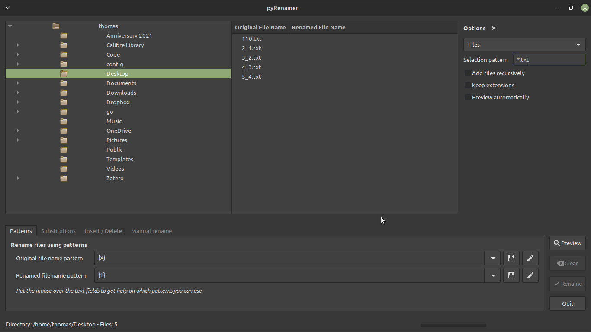

# pyRenamer

pyRenamer is an application with a graphic interface designed for renaming many files at once. It supports renaming files with patterns, substitutions, inserting text, deleting text, or even manually renaming individual files. 



## Requirements
- python3
- python3-gobject-base

## Usage

While pyRenamer is designed to be a graphical program, it can also be called from the command line. Here are the command line options:

```
python3 pyrenamer.py [-h] [-r ROOT_DIR] [-a ACTIVE_DIR]

optional arguments:
  -h, --help            show this help message and exit
  -r ROOT_DIR, --root_dir ROOT_DIR
                        The root directory of the file tree when pyRenamer
                        starts
  -a ACTIVE_DIR, --active_dir ACTIVE_DIR
                        Directory with files to be renamed when pyRenamer
                        starts
```
